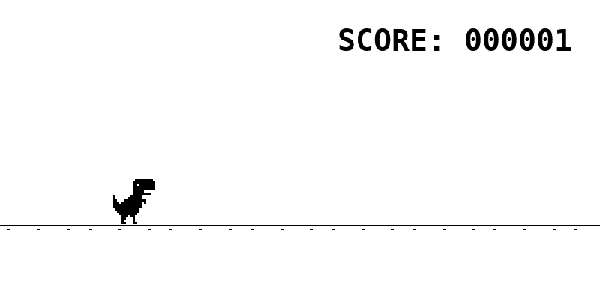

# 🦖 Dino Runner

A pixel-art endless runner inspired by the Chrome offline dinosaur game, built in Python for my [Code in Place](https://codeinplace.stanford.edu/) final project. Dodge the cacti, chain a double jump for extra height, and see how long you can last.



## About

Everything on screen — the dinosaur, cacti, clouds, and road — is drawn from scratch as grids of colored rectangles, pixel by pixel. The world scrolls left while the dino stays put, obstacles and their heights are randomized, and the score ticks up every frame you survive. Reach 100,000 and you win.

The one mechanic I'm proud of is the **double jump**: tap jump once for a normal hop, or tap it a second time mid-air to launch into a higher jump for clearing the tall cacti. It's driven by a small state machine, so the jump stays responsive without blocking the rest of the game loop.

## How to Play

| Key | Action |
| --- | --- |
| `SPACE` | Jump |
| `SPACE` again, mid-jump | Double jump (higher, for tall cacti) |

- A single jump rises 70 pixels — enough for the short cacti.
- Pressing `SPACE` a second time while rising or falling converts it into a taller jump (up to ~140 pixels) to clear the tall cacti.
- Touching a cactus ends the run. Clouds are background only and are safe to pass through.

## Features

- Hand-drawn pixel-art sprites (dinosaur, cactus, cloud, road) built entirely from rectangles
- Endless left-scrolling world with seamless road recycling
- Randomized cactus heights and spacing, so no two runs feel the same
- Responsive two-tier jump (short jump + double jump) via a non-blocking state machine
- Live scorecard with a win condition at 100,000

## Running the Game

This game is written for the **Code in Place `graphics` library** (a small wrapper around Python's built-in `tkinter`). It runs anywhere that library is available.

### 1. Get the code
```bash
git clone https://github.com/<your-username>/<your-repo>.git
cd <your-repo>
```

### 2. Get the `graphics` library

The game imports `from graphics import Canvas`. This is the Code in Place `graphics` module — a single `graphics.py` file that wraps Python's built-in `tkinter`. It is **not** the PyPI package also named "graphics", so don't `pip install graphics`.

To run the game locally, download `graphics.py` from an external source and place it in this folder, next to `main.py`:

- Search the web for **"Code in Place graphics.py"** — the file is widely mirrored on GitHub and course-related pages.
- Once you have it, drop `graphics.py` into the project folder. That's the only file you need to add.

> ⚠️ **Get the right file.** This game uses the **Code in Place** `graphics` library, whose API mirrors Tkinter's Canvas (`create_rectangle`, `moveto`, `find_overlapping`, `get_last_key_press`, etc.). It is **not** John Zelle's `graphics.py` (which uses `GraphWin`, `Rectangle`, `getKey`, …) and **not** the PyPI package named "graphics". Those have completely different APIs and the game will crash on them.

> **Note:** before committing `graphics.py` into your own copy of this repo, check the header of the file for any license or redistribution terms.

`tkinter` itself ships with most Python installs on Windows and macOS. On some Linux systems you may need to install it separately:
```bash
sudo apt install python3-tk
```

### 3. Play
```bash
python main.py
```

## Project Structure

| File | What it does |
| --- | --- |
| `main.py` | Game loop, jump state machine, collision, scoring, and all tunable constants |
| `dinosaur.py` | Draws the dinosaur sprite |
| `cactus.py` | Draws a cactus at a given height and position |
| `cloud.py` | Draws a background cloud outline |
| `road.py` | Draws the repeating road with dash marks |
| `scorecard.py` | Draws the score text |
| `new_jump.py` | Standalone jump helpers (earlier iteration of the jump logic) |
| `jump.py` | The original jump prototype, kept for reference |
| `duplicate_shape.py` | Helper for cloning shapes on the canvas |

> All the numbers that control the game's look and feel — canvas size, jump height, obstacle spacing, scroll speed — live in a clearly labeled constants block at the top of `main.py`, so they're easy to tweak.

## Future Improvements & Contributions

This started as a course project built under a deadline, so there's plenty of room to grow. If any of these sound fun, **pull requests are very welcome** — I'd love to see other coders take these on:

- **Animated dinosaur legs.** Right now the dino is a static sprite while running. I'd have liked its legs to alternate as it moves, for that classic running animation, but I ran out of time to add it.
- **Richer background scenery.** More could be happening behind the action — mountains, hills, and other distant scenery. The clouds are also all identical; giving them variable sizes and shapes would make the sky feel more alive. These were on my list but didn't make it in before the deadline.
- **A better game-over detection method.** The game currently detects a crash by checking how many shapes overlap the dinosaur's bounding box. This works, but it's fragile: because *any* extra object near the dino affects the count, it limits how much I can add to the background without risking false game-overs. A more targeted approach — for example, checking collisions only against the actual cactus objects — would decouple the difficulty from the scenery and open the door to a much busier world.

If you'd like to tackle any of these, feel free to fork the repo and open a pull request. Ideas and suggestions are welcome too.

## Credits

- Built as a final project for **[Stanford Code in Place](https://codeinplace.stanford.edu/)**.
- Rendering uses the Code in Place `graphics` library (built on `tkinter`).
- Game concept inspired by Google Chrome's offline dinosaur game. This is an independent reimplementation — no original Google code or assets are used.

## License

Released under the MIT License — see below.

```
MIT License

Copyright (c) 2026 <Your Name>

Permission is hereby granted, free of charge, to any person obtaining a copy
of this software and associated documentation files (the "Software"), to deal
in the Software without restriction, including without limitation the rights
to use, copy, modify, merge, publish, distribute, sublicense, and/or sell
copies of the Software, and to permit persons to whom the Software is
furnished to do so, subject to the following conditions:

The above copyright notice and this permission notice shall be included in all
copies or substantial portions of the Software.

THE SOFTWARE IS PROVIDED "AS IS", WITHOUT WARRANTY OF ANY KIND, EXPRESS OR
IMPLIED, INCLUDING BUT NOT LIMITED TO THE WARRANTIES OF MERCHANTABILITY,
FITNESS FOR A PARTICULAR PURPOSE AND NONINFRINGEMENT. IN NO EVENT SHALL THE
AUTHORS OR COPYRIGHT HOLDERS BE LIABLE FOR ANY CLAIM, DAMAGES OR OTHER
LIABILITY, WHETHER IN AN ACTION OF CONTRACT, TORT OR OTHERWISE, ARISING FROM,
OUT OF OR IN CONNECTION WITH THE SOFTWARE OR THE USE OR OTHER DEALINGS IN THE
SOFTWARE.
```
